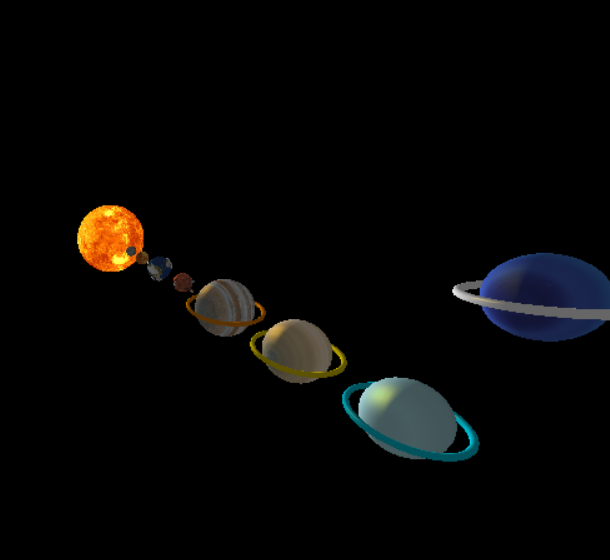
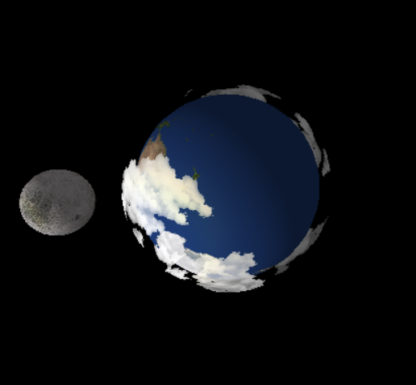
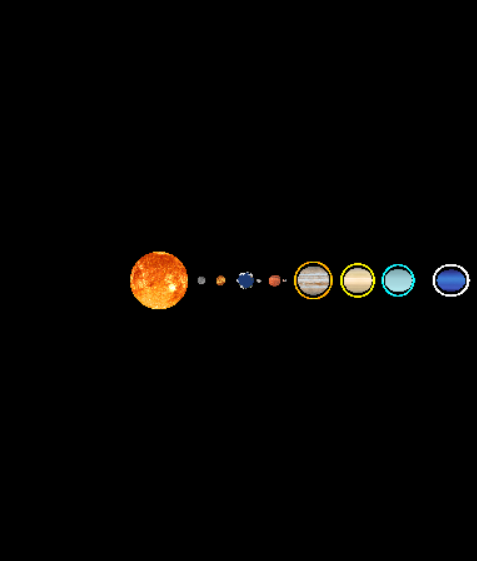

# Sistema Solar
Projeto de simulação do Sistema Solar, desenvolvido em C e OpenGL com a biblioteca FreeGLUT para disciplina Computação Gráfica do [Cefet-MG](https://cefetmg.br).

## Capturas de tela
| Visão Cinematográfica | Visão Terra-Lua | Visão Superior |
|:-------------------------------:|:----------------------:|:----------------------------:|
| |  |  |

## Preparando o Ambiente de Execução
Para compilar e executar o projeto é necessário instalar os seguintes recursos:
- GCC: `sudo apt install gcc`
- FreeGLUT: `sudo apt install freeglut3 freeglut3-dev`
- GLEW: `sudo apt install libglew-dev`
- SOIL: `sudo apt install libsoil-dev`

Após instalar os recursos, basta executar o arquivo `cg-solarSystem.sh`, localizado na raiz do repositório. Para isso, é necessário permitir a execução do stript executando o comando `chmod +x cg-solarSystem.sh` no terminal.

## Controles/interações
- <kbd>1</kbd> : visão superior;
- <kbd>2</kbd> : visão lateral;
- <kbd>SPACE</kbd> : vizualização com proximidade;
- <kbd>R</kbd> : visão cinematográfica;
- <kbd>O</kbd> : ativar ou desativar órbitas;
- <kbd>M</kbd> : ativar ou desativar a movimentação dos astros;
- <kbd>L</kbd> : modificar a iluminação do sistem solar;
- <kbd>ESC</kbd> : fechar simulação.

## Créditos
- Devs: [Luísa Oliveira](https://github.com/luisaoliveira), [Pedro Vaz](https://github.com/vazConnected) e [Stéphanie Fonseca](https://github.com/steponnie);
- Prof.: [Glender Brás](https://github.com/glenderbras);
- Texturas: [Solar System Scope](https://www.solarsystemscope.com/textures/).
